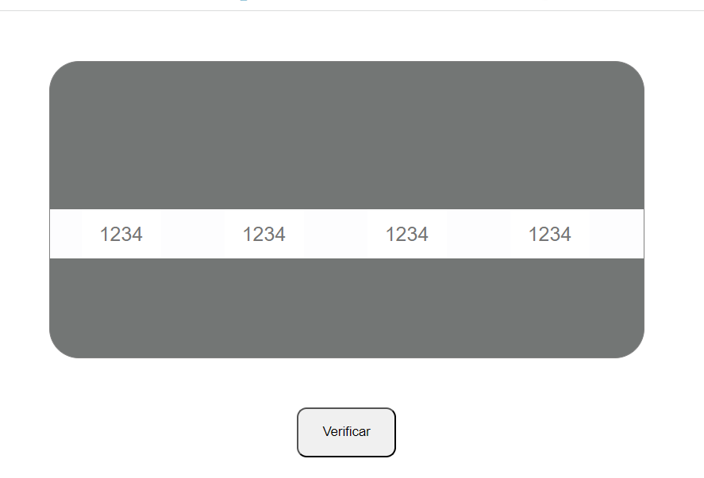
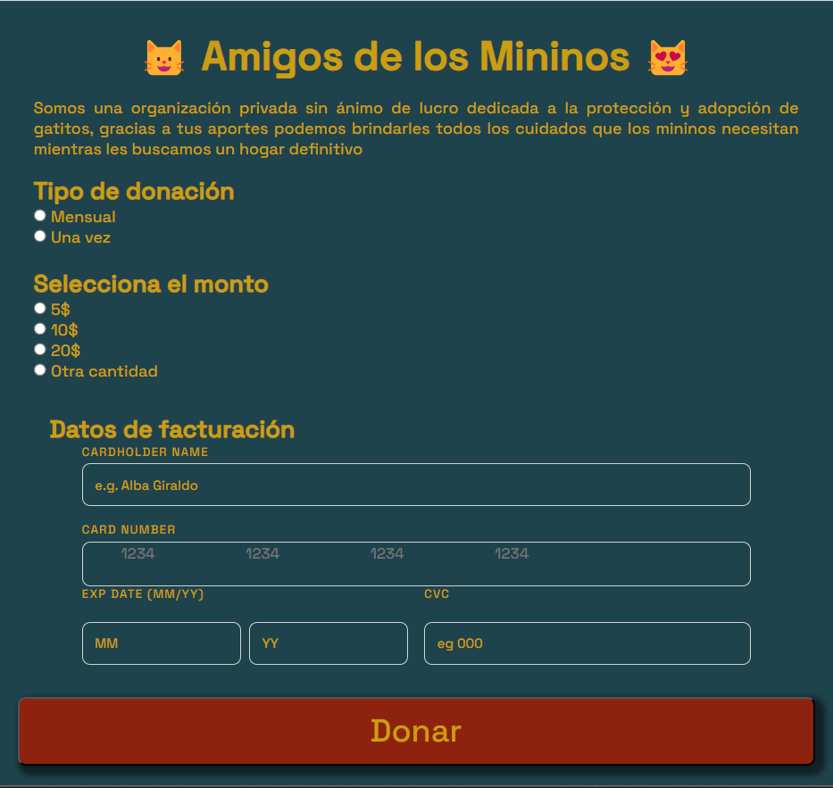
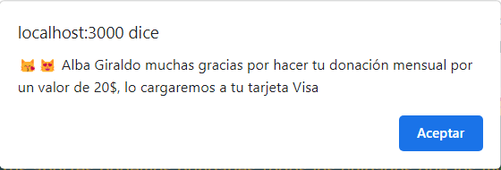

# Tarjeta de Crédito Válida

## Indice

- [1. Presentació del producto](#1-presentacion)
- [2. Flujo de Trabajo.](#2-flujo-de-trabajo)
- [3. Usuarios potenciales de la palicación](#3-usuarios-potenciales-de-la-aplicacion)

## 1. Presentación

Esta página fue el primer proyecto construído dentro del bootcamp de Laboratoria cohort 009. El bjetivo principal es realizar la verificación de una tarjeta de crédito (utilizando el algoritmo de Luhn) y en caso de que la tarjeta sea válida enmascar sus dígitos menos los cuatro últimos.

Como parte del proyecto se debe crear un contexto dentro del cual sería necesario y útil contar con una funcionalidad como ésta, es decir validar un medio de pago.

## 2. Flujo de Trabajo.

### 2.1 Diseño de prototipo de baja fidelidad

Para crear una experiencia de usuario inmersiva, la validación de la tarjeta está creada como parte de una página en la cual se pueden hacer donaciones para una fundación sin ánimo de lucro dedicada a cuidar animalitos.

Utilizando Figma se diseñó un prototipo de baja fidelidad, que permite visualizar un posible layout básico de la futura UI:

### 2.2 UI inicial y Codificación de métodos principales.

Depués de tener el prototipo de baja fidelidad procedí a escribir código en HTML y CSS para diseñar solo la parte en la cual el usuario debe digitar, en este caso, los 16 dígitos de la tarjera de crédito.

Hice esto como primer etapa dentro del flujo de trabajo pues consideré que el principal cuello de botella lo podría encontrar en la implementación del algoritmo de Luhn y el posterior enmascarado de los números y pasar los test.

La primera UI que permitía solo el ingreso de los 16 dígitos de la tarjeta de crédito se veía así:

#### Método isValid.

En este método se implementa el algoritmo de Luhn, el cual fue creado por Hans Peter Luhn, un científico de IBM, y se utiliza para validar números de tarjetas de crédito o SIM. Los pasos a seguir para implemtar este algoritmo son los siguientes:

- Se lee un string que contiene los dígitos de la tarjeta de crédito
- Se invierte el orden de los elementos del string
- Se duplican los dígitos que se encuentran en posiciones impares

- Se suman los dígitos de cada número considerando que si la multiplicación anterior dió como resultado un valor mayor que 10 entonces primero se deben sumar los dígitos de dicho resultado.

- Si la sumatoria anterior es múltiplo de 10 entonces el número es válido.

Este algoritmo se codificó en JavaScript como un método del objeto validator y arroja como rsultado un booleano.

#### Método masiky.

Este método se utiliza en la aplicación para enmascarar los dígitos de la tarjeta de crédito a excepción de los 4 últimos; dentro de la lógica que sigue el código dicho método solo se ejecuta cuando **isValid** arroja como resultado **true**

Finalizada esta fase del proyecto ya se contaba con una aplicación funcional que desplegaba una UI muy básica pero con la capacidad de leer los dígitos introducidos por un usuario y posteriormente correr los métodos de **isValid** y **maskify**. Igualmente los códigos de los métodos ya pasaban los test.

### 2.2.3 Diseño de prototipo de alta fidelidad y y codificación de UI completa.

El siguiente es el prototipo de alta fidelidad que diseñé inicialmente:

Como puede apreciarse tenía la intención de contar con una parte para la digitación de la información de facturación y otra con un layout de una tarjeta de crédito a la cual se le transfería la información de la tarjeta.

Sin embargo decidí simplificar la UI dado que aun me falta conocimiento y experiencia en HTML semántico, jerarquización y CSS. Finalmente la aplicación presenta la siguiente interfaz:

Como puede verse en UI el usuario puede escoger el tipo de donación bien sea mensual o por una sola vez, igualmente la aplicación le ofrece unos montos predefinidos para su donación pero igualmente le brinda la opción de ingresar un valor diferente.

En la parte inferior aparecen los campos necesarios para llenar toda la información de facturación. y un botón que al clickearlo procede a leer todos los datos y correr los métodos **isValid** y **maskify**.

### 2.2.4 Captura de errores: Ultima fase de codificación.

Para los campos que reciben información numérica se codificaron capturas de error de manera tal que sólo se puedan ingresar caracteres numéricos y de determinada longitud.

Si la información suministrada en un campos is incorrecta la aplicación borra dicha información y le devuelve el foco al input correspondiente para poder corregir.

Cuando el usuario ha ingresado toda la información y hace click en el botón "Donar" el script verifica que el número de la tarjeta de crédito contenga todos los dígitos completos y entonces procede a realizar la verificación y el posterior enmascarado de los 12 primeros dígitos.

Si todo sale correctamente la página le muestra un mensaje agradecimiento personalizado al donador en el cual se especifica su nombre, tipo de donación, monto y franquicia (la página solo acepta Visa y MasterCard)

## 3. Usuarios potenciales de la aplicación.

Este tipo de aplicación le puede resultar muy útil a cualquier tipo de organización que necesite recaudar fondos a partir de donaciones.

Esta aplicación en particular ofrece una buena experiencia de usuario ya despliega una interfaz de fácil interacción y a prueba de los errores típicos.
